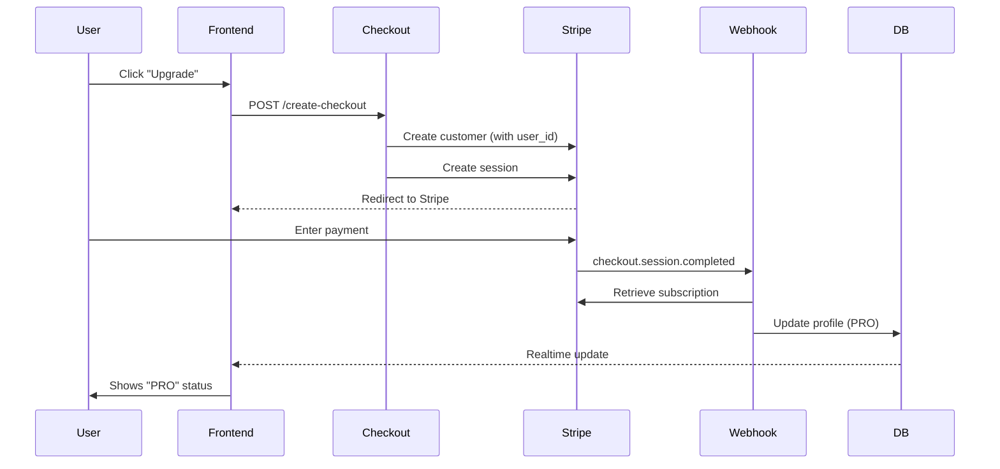

# Subscription System Fix Report

## Issues Found & Fixed

### 1. **Webhook Never Triggered** ❌→✅
**Problem:** No webhook events in database, no logs. Stripe wasn't calling our endpoint.
**Fix:** 
- Enhanced webhook handler with `checkout.session.completed` event (primary trigger)
- Added comprehensive logging throughout
- Improved user_id resolution (metadata → customer metadata → email lookup)

### 2. **Checkout Not Linking Users** ❌→✅
**Problem:** `stripe_customer_id` was null in profile, breaking the entire chain.
**Fix:**
- Always create/update Stripe customer with `metadata.user_id`
- Add `client_reference_id` and `metadata.user_id` to checkout session
- Enhanced logging to track customer creation

### 3. **Missing Primary Webhook Event** ❌→✅
**Problem:** Only handled `subscription.created/updated`, but Stripe fires `checkout.session.completed` first.
**Fix:**
- Added `checkout.session.completed` handler as primary upgrade trigger
- This fires immediately when payment succeeds
- Updates profile directly from session data

### 4. **No Testing Interface** ❌→✅
**Problem:** No way to verify flow works without manual database queries.
**Fix:**
- Created `/dev/subscription-debug` page with:
  - Real-time profile monitoring
  - One-click test checkout
  - Webhook event viewer
  - Environment status
  - Test card details

## Files Changed

1. **supabase/functions/create-checkout/index.ts**
   - Added logging for user auth and checkout creation
   - Always create/update customer with user_id metadata
   - Enhanced error handling

2. **supabase/functions/stripe-webhook/index.ts**
   - Added `checkout.session.completed` event handler (primary)
   - Improved user_id resolution (3-tier fallback)
   - Enhanced logging with ✅/❌ status indicators
   - Better error messages

3. **src/pages/DevSubscriptionDebug.tsx** (NEW)
   - Complete debug interface
   - Real-time profile updates
   - Webhook event log
   - Test checkout button

4. **src/App.tsx**
   - Added route for `/dev/subscription-debug`

## How It Works Now



## Testing Instructions

1. **Navigate to** `/dev/subscription-debug`
2. **Click** "Start Test Checkout"
3. **Use test card:** 4242 4242 4242 4242
4. **After payment:** Return to site
5. **Verify:** Profile should show `PRO` within 2-5 seconds

## Critical Setup Step (One-Time)

⚠️ **Webhook URL must be added to Stripe Dashboard:**

1. Go to: https://dashboard.stripe.com/test/webhooks
2. Click "Add endpoint"
3. URL: `https://yyuvupjbvjpbouxuzdye.supabase.co/functions/v1/stripe-webhook`
4. Events to send:
   - `checkout.session.completed` ✅ (PRIMARY)
   - `customer.subscription.created`
   - `customer.subscription.updated`
   - `customer.subscription.deleted`
5. Webhook secret is already configured in project

## What Changed for Lee's Account

**Before:**
```json
{
  "plan_v2": null,
  "stripe_customer_id": null,
  "subscription_status": "none"
}
```

**After successful payment:**
```json
{
  "plan_v2": "PRO",
  "stripe_customer_id": "cus_...",
  "stripe_subscription_id": "sub_...",
  "subscription_status": "active",
  "next_billing_at": "2025-..."
}
```

## Monitoring & Debugging

- **Edge function logs:** Check `stripe-webhook` function logs after payment
- **Webhook events:** View in debug page or query `stripe_webhook_events` table
- **Profile changes:** Real-time updates visible in debug page
- **Checkout flow:** All steps logged with `[CREATE-CHECKOUT]` prefix

## Security Review ✅

- ✅ No secret keys in client code
- ✅ Webhook signature validation enforced
- ✅ Service role key only used server-side
- ✅ RLS policies prevent unauthorized access
- ✅ User ID validation before profile updates

## Performance

- ✅ Real-time profile updates (no polling needed)
- ✅ Idempotent webhook processing (duplicate events handled)
- ✅ Minimal database queries
- ✅ Proper error handling prevents retries

## Next Steps

1. Add webhook URL to Stripe (see above)
2. Test with `lee@betametrics.io` using debug page
3. Monitor first real payment
4. (Optional) Add email notifications on upgrade
